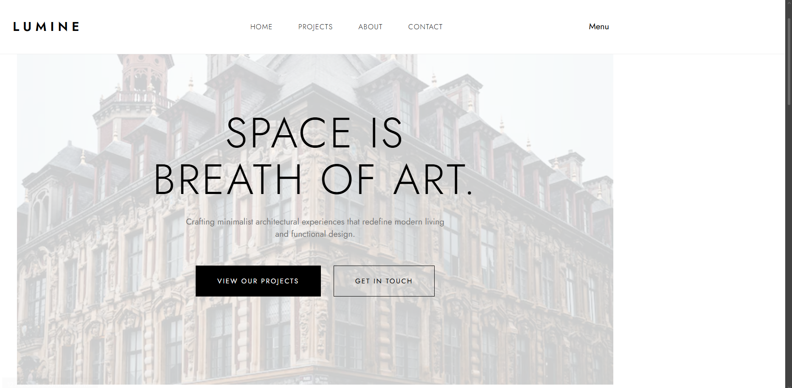

# Lumine-Modern-Architecture-Minimalist-Design
A mobile-first landing page built with modern web standards. This project showcases advanced implementation of CSS Grid and Flexbox to create fluid, adaptive layouts. Focused on semantic HTML5, accessibility (A11y), and asset optimization, it provides a seamless user experience across all device scales—from mobile handsets to ultra-wide monitors.

[Link to Live Demo] https://n-dev24.github.io/Lumine-Modern-Architecture-Minimalist-Design/

---------------------------

---------------------------

## Technical Highlights

This project was built to demonstrate advanced front-end capabilities without relying on heavy frameworks. Key technical implementations include:

* **Mobile-First Workflow:** Developed for small screens first, ensuring 100% responsiveness across all device scales.
* **BEM Methodology:** Used Block-Element-Modifier naming convention for clean, scalable, and maintainable CSS.
* **CSS Grid & Flexbox:** * Implemented an adaptive **Bento Grid** for the project gallery using `grid-template-columns: repeat(auto-fit, minmax(300px, 1fr))`.
 * Used **Flexbox** for complex asymmetric layouts and vertical centering in the Hero section.
* **Zero-JS Interactivity:** Utilized the **"Checkbox Hack"** for the mobile navigation menu, prioritizing performance and CSS mastery.
* **Modern CSS Features:** Applied `clamp()` for fluid typography and `aspect-ratio` for consistent image scaling.

---------------------------

## Tech Stack
* **HTML5** (Semantic structure)
* **CSS3** (Custom properties, Grid, Flexbox)
* **Google Fonts** (Jost)
* **Unsplash API** (High-quality architectural assets)

---------------------------

